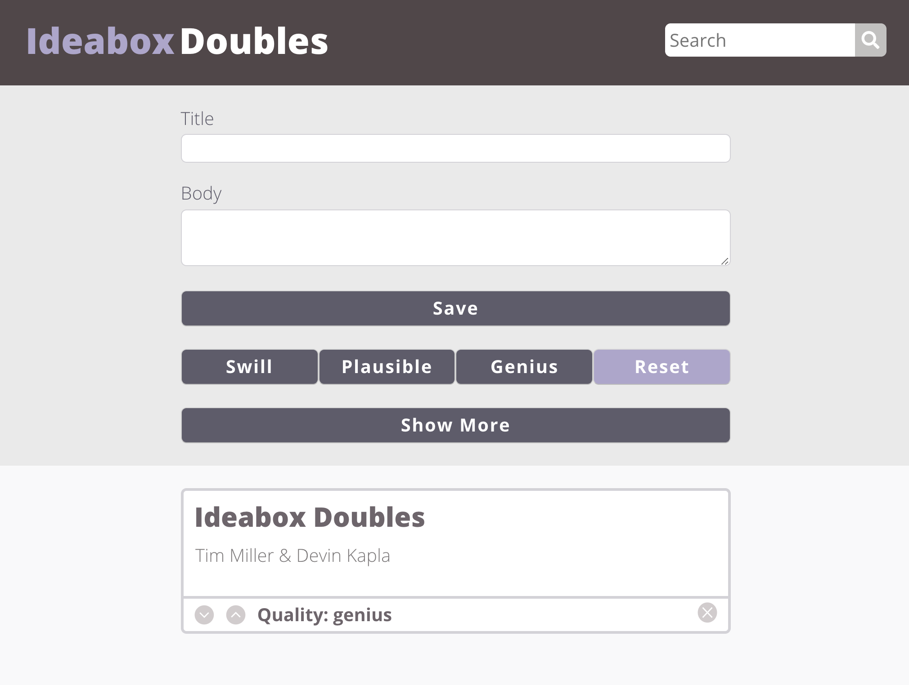
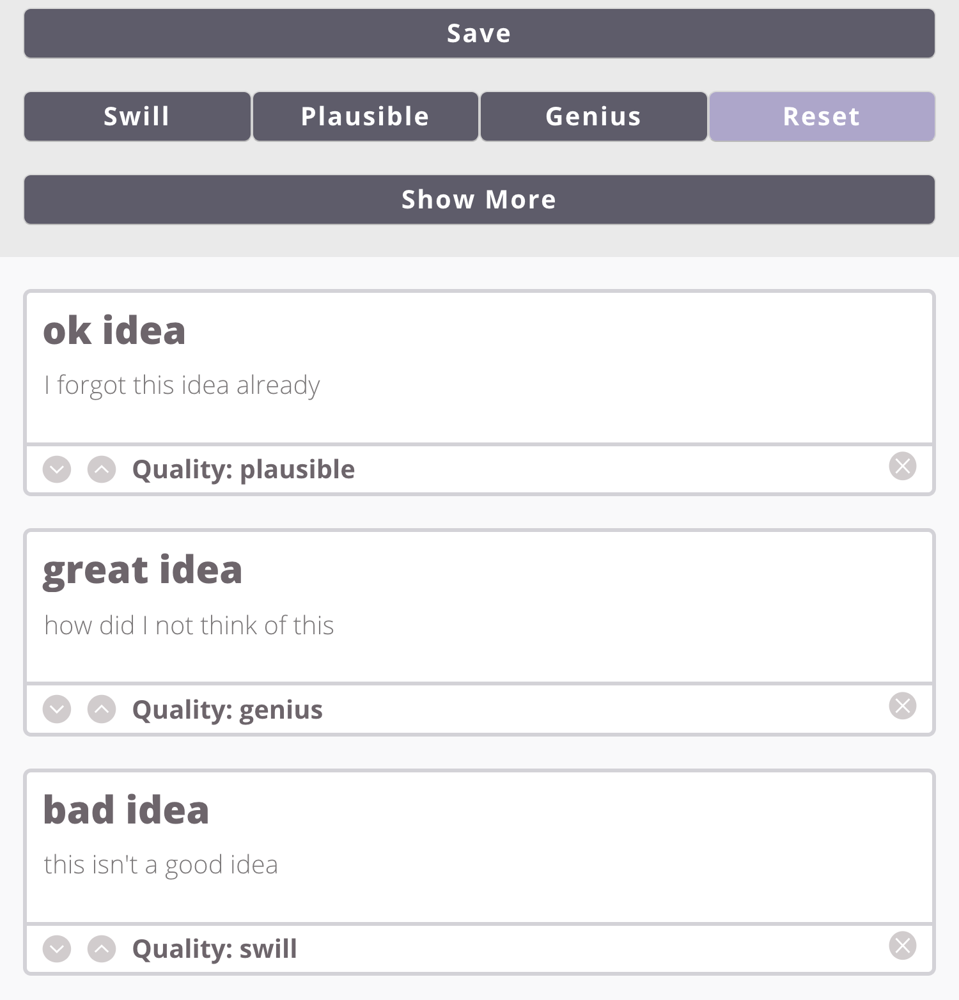
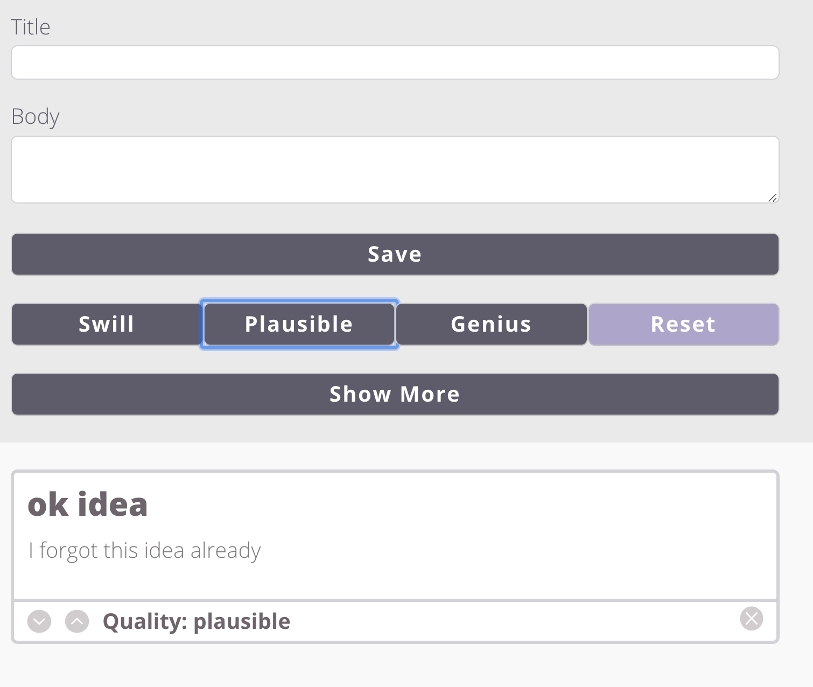
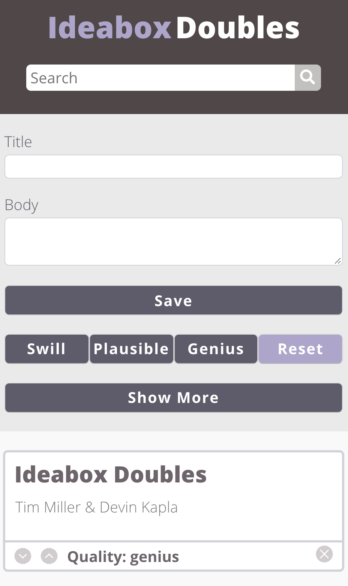

# ideaBoxDoubles

##A web-based application that allows user to add and edit ideas

##The Ideabox app allows a user to keep track of their ideas in several ways, differentiating them using titles, body content, and quality filters. Ideas are then saved to local storage which allows users to make adjustments at a later time if/when they update their idea(s). Users are able to sort their ideas based on quality and can use the search feature to find ideas based on title and body content as well as removing ideas from their list.

Usage example
In this first example the user has added several ideas to their list and changed their quality:

In this second example the user has filtered down to just the plausible ideas from their list:

Built With
HTML
CSS
Javascript

Contributors
Tim Miller  
Devin Kapla

Comp:
Our comp:

Provided comp:
